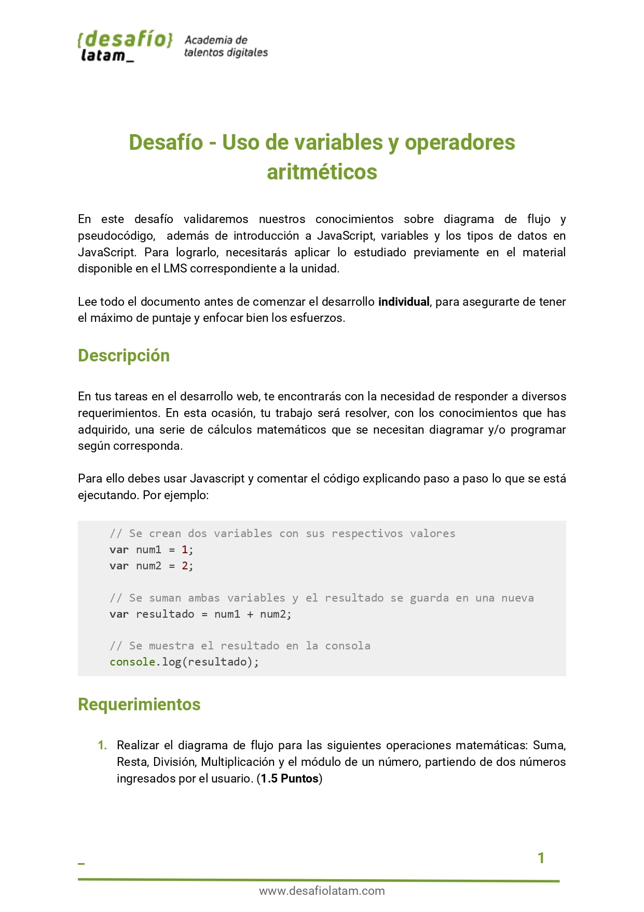
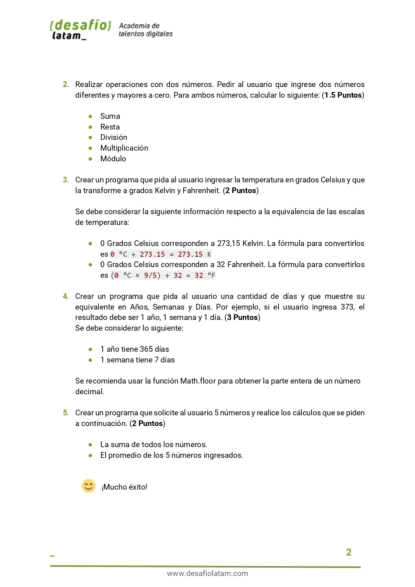
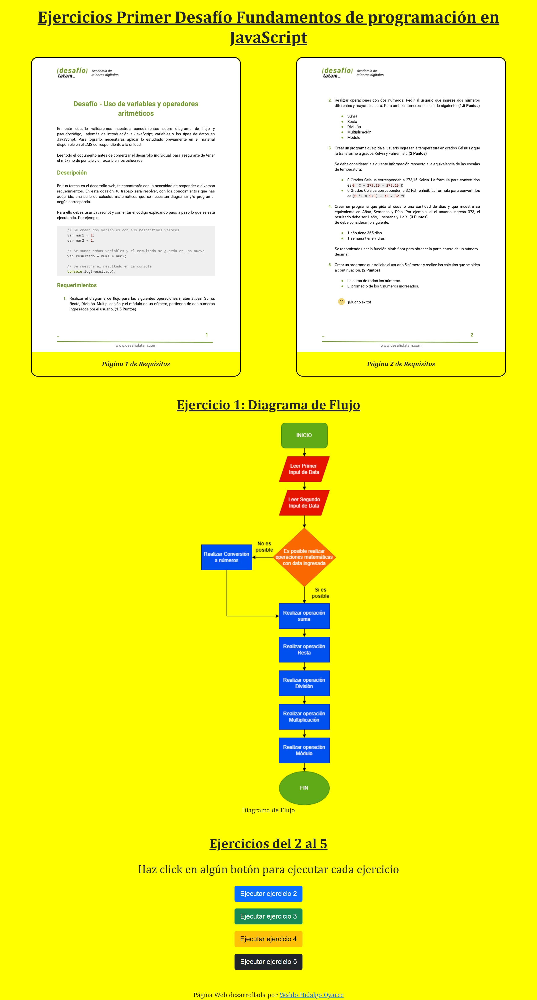
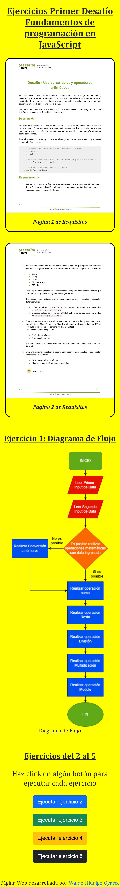
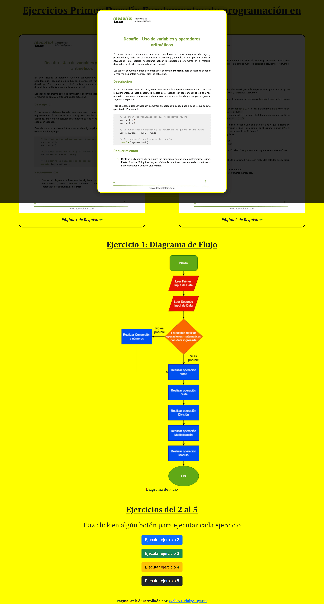

Este repositorio contiene el código del primer desafío del módulo Fundamentos de JavaScript dictado por Desafio Latam.

He utilizado:

Los requisitos del proyecto son los siguientes:

He creado una página web responsiva de manera rapida usando Bootstrap y CSS Grid la cual muestro a continuación:

# 1. En pantallas grandes

# 2. En pantallas small

Además, he creado una lightbox para mostrar la imagen de los requisitos con mayor detalle:

En el proyecto las imagenes estan optimizadas en formato webp.
